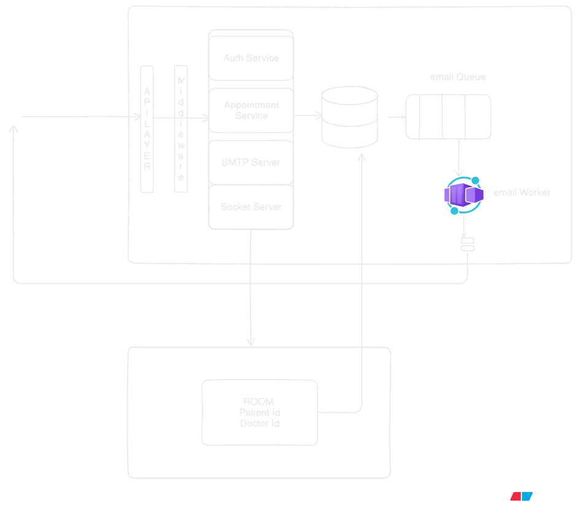

# Medics

## Overview

Medics is a full-stack medical appointment system with patient, doctor, and admin roles. The application includes:
- a React + Vite frontend with Ant Design UI components
- an Express backend written in TypeScript
- MongoDB for persistent storage
- Redis for Socket.IO scaling and BullMQ queueing
- email notification support for appointment workflows

## Architecture

### Architecture diagram

### Frontend

- React 19, Vite, TypeScript
- Ant Design for layout and UI components
- Axios for REST API communication
- Zustand for state management
- React Router v7 for route-based access control
- Socket.IO client for real-time chat
- Local development proxy configured in `frontend/vite.config.ts`

### Backend

- Node.js and Express 5 with TypeScript
- MongoDB via Mongoose
- Redis via ioredis
- Socket.IO server with Redis adapter for multi-instance scaling
- BullMQ for email queue processing
- Nodemailer for outbound email delivery

### Data and request flow

1. The frontend calls backend APIs under `/api/*`.
2. Authentication is handled through JWT tokens and cookies using `auth.middleware.ts`.
3. Doctor schedules and available slots are generated from `Doctor` working hours and slot duration.
4. Appointments are persisted in MongoDB.
5. Real-time chat connections are routed through Socket.IO.
6. Email notifications are queued in BullMQ and processed asynchronously by `email.worker.ts`.

## Repository structure

### Backend

- `backend/src/server.ts`
  - entry point for Express server and HTTP server creation
- `backend/src/config/connectDb.ts`
  - MongoDB initialization
- `backend/src/config/connectSocket.ts`
  - Socket.IO server and Redis adapter initialization
- `backend/src/config/redis.ts`
  - Redis client configuration using `REDIS_URL`
- `backend/src/controllers`
  - business logic for auth, appointments, doctor profile, and admin workflows
- `backend/src/routes`
  - API route definitions for auth, appointments, chat, doctor, and admin
- `backend/src/utils/mailer.ts`
  - email transport configuration
- `backend/src/utils/queue.ts`
  - BullMQ queue connection using Redis
- `backend/src/workers/email.worker.ts`
  - asynchronous email worker

### Frontend

- `frontend/src/App.tsx`
  - application bootstrap with router and theming
- `frontend/src/routes/index.tsx`
  - route definitions and role-protected routing
- `frontend/src/api/axios.ts`
  - Axios instance with base URL and request interceptors
- `frontend/src/store`
  - `authStore.ts` for authentication state
  - `chatStore.ts` for chat socket lifecycle and unread counts
- `frontend/src/pages`
  - role-specific pages for patient, doctor, and admin flows
- `frontend/src/components/ChatDrawer.tsx`
  - chat UI integration

## Deployment

### Backend

- Root: `backend`
- Build: `npm run build`
- Start: `npm start`
- Required environment variables:
  - `MONGODB_URI`
  - `JWT_SECRET`
  - `EMAIL_USER`
  - `EMAIL_PASS`
  - `REDIS_URL`
  - `FRONTEND_URL`
  - `PORT`

### Frontend

- Root: `frontend`
- Build: `npm run build`
- Vercel config file: `frontend/vercel.json`
- Environment variable:
  - `VITE_API_URL`
- Production URL: `https://medics-zeta.vercel.app/`

### Demo admin access

- Email: `admin@admin.com`
- Password: `admin123`

## Notes

- There is no explicit architecture diagram asset present in the repository.
- The described architecture is derived from the current codebase and deployment documentation.
- Redis is used for both Socket.IO pub/sub and BullMQ queueing, so a single `REDIS_URL` should be shared across backend components.
- The frontend uses the backend proxy in development and a production API base URL via `VITE_API_URL`.
